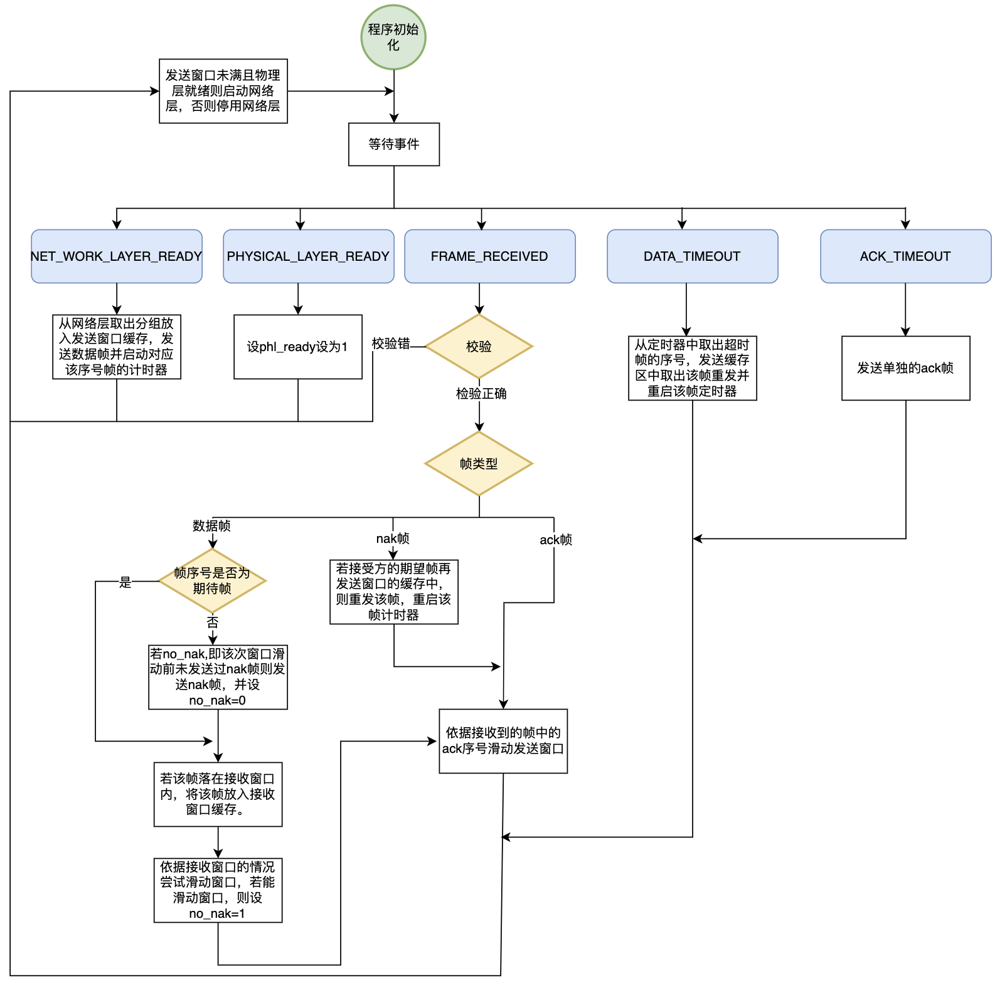
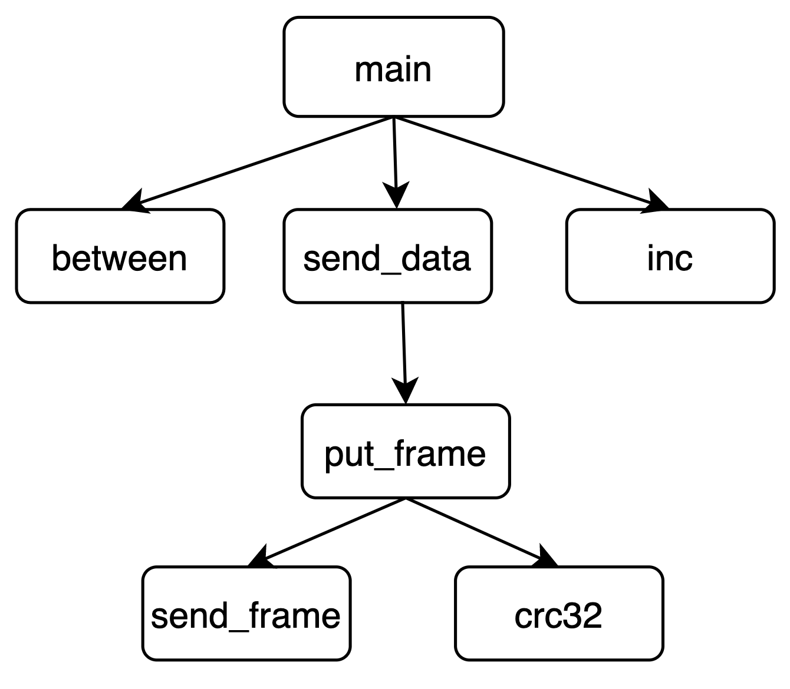
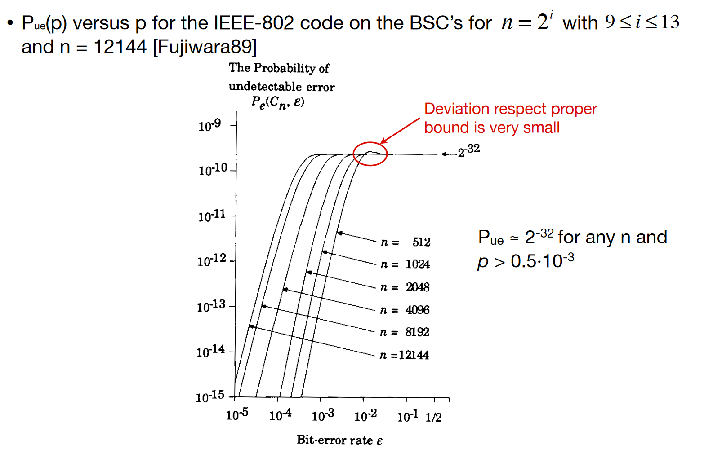

# 滑动窗口协议

本实验的内容是在已搭建好的仿真框架下实现数据链路层的滑动窗口协议 (包括 Go-Back-N 和 Selective Repeat 协议). 模拟信道的默认参数为: 8000bps 全双工, 270ms 传播时延, 1e-5 信道误码率. 信道提供字节流传输服务, 网络层分组长度为 256 字节.

在源码中 `protocol.h` 中定义了与仿真框架交互的各种接口, `datalink.c` 和 `datalink.h` 实现了一个简易的 Stop-and-Wait 协议, 可作为样例参考.

本实验使用的环境是: 

- 系统: Linux
- 构建工具: CMake
- IDE: CLion

## Go-Back-N 协议

### 软件设计

Go-Back-N 协议由 `gobackn.c` 和 `common.h` 组成. 其中数据结构以及变量作用均有详细的注释. 例如帧的结构:

```text
data frame
+---------+--------+--------+-----------+----------+
| kind(1) | ack(1) | seq(1) | data(256) | crc32(4) |
+---------+--------+--------+-----------+----------+

ack/nak frame
+---------+--------+----------+
| kind(1) | ack(1) | crc32(4) |
+---------+--------+----------+
```

以及核心的协议参数:

```c
// 最大 seq 值, seq = 0, 1, ..., MAX_SEQ
#define MAX_SEQ 7

// 数据帧超时时间
#define DATA_TIMEOUT_MS 2000

// piggyback ack 延迟超时时间
#define ACK_TIMEOUT_MS 500
```

其他的数据结构和函数信息可以参考源码.

主程序在接收到事件之后, 主要流程如下:


以及计时器超时后的处理:

```c
case DATA_TIMEOUT:
 dbg_event("DATA frame <seq=%d> timeout\n", arg);

    next_frame_to_send = ack_expected;
    for (seq_t i = 0; i < buffer_len; i++) {
        send_data_frame(next_frame_to_send, frame_expected, buffer);
        inc(next_frame_to_send);
    }
    break;

case ACK_TIMEOUT:
    send_ack_frame(frame_expected);
    stop_ack_timer();
    break;
```

除了收发帧, 该协议还考虑到了层间的流量控制:

1. 与物理层之间的流量控制
    - 每次调用 `send_frame()` 后将全局变量 `phl_ready` 置 `false`
    - 物理层发送队列低于 50 字节水平时，会产生 `PHYSICAL_LAYER_READY` 事件, 此时将 `phl_ready` 置 `true`
    - 若 `phl_ready` 为 `false`, 禁用网络层, 不再接收 packet

2. 与网络层之间的流量控制
   - 只要 `phl_ready` 为 `true` 且 packet buffer 未满, 则允许网络层发送 packet
   - 网络层若有 packet 需要发送, 则会产生 `NETWORK_LAYER_READY` 事件, 此时将 packet 存入 buffer 并发送 (详细过程见「主要流程」)

### 结果分析

经过测试, 本协议实现了有误码信道环境中无差错传输功能, 可以可靠地长时间运行.

#### 理论值分析

无差错信道上最大信道利用率为 `256 / (3 + 256 + 4) = 97.3%`. 在误码率为 1e-5 的信道上, 传输 `100000 / ((3 + 256 + 4) * 8) = 47` 个帧会有一个错误, 此时需要重传 `n (1 <= n <= MAX_SEQ + 1)` 次 (假设重传的帧不会出错). 在本协议中, `MAX_SEQ = 7`, 平均重传次数为 4.5 次, 故信道利用率为 `(256 * 47) / ((3 + 256 + 4) * (47 + 4.5)) = 88.8%`.

#### 参数选择

基于实验模拟的环境 (8000bps 全双工, 延迟 270ms, 误码率 1e-5), 对于 `MAX_SEQ`, `DATA_TIMEOUT_MS` 和 `ACK_TIMEOUT_MS` 这三个参数的选择, 分析如下:

1. `MAX_SEQ`: 滑动窗口的大小涉及到信道利用率和流量控制问题. 如果窗口太小, 流水线无法填满, 导致信道利用率低; 如果窗口太大, 会导致接收方处理不过来, 导致数据丢失. 窗口大小的一个下界是 `(2 * (帧传输时间 + 线路延迟) + t) / 帧传输时间`, 其中 t 是 `ACK_TIMEOUT_MS`.

2. `DATA_TIMEOUT_MS`: 重传定时器的设置要考虑到必要的传输时间和处理时间. 另外由于本协议使用了 NAK, 这个时限可以适当放宽. 这个时限的下界至少是 `2 * (帧传输时间 + 线路延迟) + t`.

3. `ACK_TIMEOUT_MS`: ACK 定时器的下界应该为网络层产生一个 packet 的时间, 由于这个时间无法准确得知, 所以只能通过实验获取一个经验值, 约为 500 ms.

结合理论分析和实践观察, 确定了最优值为 `MAX_SEQ = 7`, `DATA_TIMEOUT_MS = 2000`, `ACK_TIMEOUT_MS = 500`.

#### 测试结果

下表为测试 15 分钟得到的利用率, 其中 `命令` 列省略了站点 B 的命令 (和站点 A 参数一致).

| 命令                     | 说明                                                 | 站点 A 利用率 | 站点 B 利用率 | 理论值   |
|------------------------|----------------------------------------------------|----------|----------|-------|
| `gobackn a -u`         | 无误码信道, 站点 A 平缓发出数据, 站点 B 以「发送 100 秒，慢发 100 秒」周期性交替 | 51.59%   | 96.97%   | NA    |
| `gobackn a -fu`        | 无误码信道, 洪水式产生 packet                                | 96.97%   | 96.97%   | 97.3% |
| `gobackn a -f`         | 洪水式产生 packet                                       | 87.06%   | 87.01%   | 88.8% |
| `gobackn a`            | 默认, 站点 A 平缓发出数据, 站点 B 以「发送 100 秒，慢发 100 秒」周期性交替    | 47.14%   | 88.22%   | NA    |
| `gobackn a -f -b 1e-4` | 洪水式产生 packet, 线路误码率设为 1e-4                         | 37.41%   | 35.14%   | 49.7% |

可以看出, 协议在多个场景下均与理论值相差不大. 其中误码率设为 1e-4 时效率相差较大, 主要原因是假设了重传的帧不会出错, 以及忽略了层间传输和缓冲区的延迟. 进一步可以改进帧的结构, 让其携带自身站点的拥堵信息, 供发送方控制流量.

## Selective Repeat 协议

### 软件设计

#### 帧结构

选择重传协议中有三种：数据帧、ack帧、nak帧，其结构如下

```c

/* FRAME kind */
#define FRAME_DATA 1
#define FRAME_ACK  2
#define FRAME_NAK  3

/*  
    DATA Frame
    +=========+========+========+===============+========+
    | KIND(1) | SEQ(1) | ACK(1) | DATA(240~256) | CRC(4) |
    +=========+========+========+===============+========+

    ACK Frame
    +=========+========+========+
    | KIND(1) | ACK(1) | CRC(4) |
    +=========+========+========+

    NAK Frame
    +=========+========+========+
    | KIND(1) | ACK(1) | CRC(4) |
    +=========+========+========+
*/
```

针对帧结构定义了以下结构体

```c
struct frame {
	frame_kind kind; /* FRAME_DATA */
	seq_nr ack;
	seq_nr seq;
	packet info;
	unsigned int checksum;
};
```

因为不同帧结构包含内容不同，为了解决发送不同帧时内部结构不同的问题，写了如下的辅助函数

```c
static void put_frame(unsigned char *frame, int len) {
	*(unsigned int *)(frame + len) = crc32(frame, len);
	send_frame(frame, len + 4);
	phl_ready = 0;
}
```

该函数会依据参数len的值来填充crc32校验，其中frame参数为指向frame结构体指针，针对不同帧，给定不同len值即可发送正确的帧。

#### 程序运行流程

程序在进行初始化后通过等待不同事件并对不同事件进行处理来完成协议功能。对各种事件定义如下

```c
#define NETWORK_LAYER_READY  0
#define PHYSICAL_LAYER_READY 1
#define FRAME_RECEIVED       2
#define DATA_TIMEOUT         3
#define ACK_TIMEOUT          4
```

上述各事件解释如下

- `NETWORK_LAYER_READY`:网络层有分组要发送。
- `PHYSICAL_LAYER_READY`:物理层准备就绪。
- `FRAME_TIMEOUT`:从物理层接收到了帧。
- `DATA_TIMEOUT`：计时器超时。
- `ACK_TIMEOUT`:`ack`计时器超时。


#### 算法流程

实现选择重传的算法流程如下:



#### 模块结构

为了实现上述的算法流程，程序实现中划分了如下函数

```c
// 该函数判断b序号是否在另外a、c序号之间
static unsigned char between(seq_nr a, seq_nr b, seq_nr c);

// 该函数在帧结构处有所描述，按照len给帧添加校验并送到物理层
static void put_frame(unsigned char *frame, int len) ;

// 依据不同的帧类型发送帧
// 发送前停止ack_timer
// 该函数根据调用put_frame来发送帧
// 若发送帧类型为data 该函数还负责启动对应帧的计时器
static void send_data(frame_kind fk, seq_nr frame_nr, seq_nr frame_expected, packet buffer[]) ;

// 一下宏实现帧序号自增
#define inc(x) x = (x == MAX_SEQ) ? 0 : x + 1;
```

程序调用关系图如下：



---

### 结果分析

#### 传输功能与程序健壮性

该实验要求完成两个站点之间的有误码信道中无差错传输功能。通过实现一个选择重传的协议，我们实现了有误码信道的无差错传输功能，在实验测试中，我们测试了如下各种情况下协议的运行情况

- `--utopia`两站点无误码信道传输
- 站点A分组层平缓方式发出数据，站点B周期性交替“发送100秒，停发100秒“
- `–-flood --utopia`站点AB均在无误码信道下洪水式产生分组
- `--flood`误码率为1e-5的信道下洪水式产生分组
- `--flood  -–ber=1e-4`更高误码率下洪水式产生分组

在以上各个情况下，实现的选择重传协议均可以保持长时间的正常工作（工作了20分钟以上），均可实现无差错传输功能，程序未出现死锁或报错等情况。以上的测试也证明了程序的健壮性。

---

#### 选择重传各参数的选取

##### 窗口大小的选取

设两个站点均不断的有分组要发送，且传输无差错。
$$W_t:发送窗口 \quad W_r:接收窗口 \quad L:帧长度 \quad c:数据率 \quad D:有效数据长度\quad T_p:传播时延$$
设在理想情况下，接收站点收到一帧信息后很快就用piggyback的方式回复ack,则信道利用率为
$$utilization = \frac{D}{L}\times\frac{W_r\times L/c}{2T_p+2L/c}$$
其中上式等号右边乘号的右半部分上限为1，在该实验中D = 256B,L = 263B ,c=8000bps,T_p = 270ms,代入数据计算得，当W_r大于4.0532时，上式乘号右半部分将达到1,信道利用率达到极限，此时信道利用率为
$$utilization = \frac{D}{L}\times1=97\%$$
实际传输中，为了防止接受方因为处理或者丢包之类情况的导致发送方迟迟收不到ack而停下发送等ack,应该尽可能的将发送窗口设置大一些，但设置过大可能导致因为接受方无法迅速处理收到的帧，缓存队列溢出而丢包的情况。在本实验中，物理层仿真环境有64KB的缓存，经过多次尝试，将W_t和W_r设置为64，即将MAX_SEQ设为127，这样可以取得较高的效率，该窗口大小足够大，且不会大到快速填满物理层的缓存队列。

---

##### ack_timer的选取

在选择重传协议的实现中回复ACK采用了piggyback的方式，在发送数据时捎带ACK以提高效率，但若网络层空闲，迟迟不提供分组，则需要回复一个短的ACK帧防止发送方重传计时器超时。ack_timer的值应该要大于数据链路层从网络层获取分组的平均时间。


经过实际测试，发现在flood模式下网络层提供分组的时间间隔大约为两百多毫秒，经过多次测试，最终选取了ack超时时间为1000ms。


##### Data_timer的选取

一个帧发出去后若长时间未能收到相应的ack便可以判断为该帧传输失败了，此时应该重传该帧，这个时间的选取与一帧信息发出直到收到相应ack之间的时间间隔有关。以下分析最快收到ack和最慢收到ack的情况。


在最好的情况下，一帧发出去，接受方立即通过发回一帧回复，传播时延270ms,接受方发一帧时间为261ms,传播回发送方需要270ms，总共需要803ms。在最慢的情况下，接受方等待了一个ack_timer的时间后发送ack,中间可能需要在物理层排队，再加上物理层加的帧间隔，大致需要两秒多的时间。


经过尝试，将Data_timer设置为3000ms可以取得较好的效果。

#### 理论分析

由前面窗口大小分析小节可以得到在无误码洪水式产生分组的情况下信道利用率将达到上限97%,在误码率为1e-5的情况下，平均发送100000bit出现一帧错误，即平均发送47帧出现一次错误。假设该帧重发时不出错且接受方传递ack发送方能争取收到，则此时平均发送48帧的时间成功传递的帧为47帧，故有
$$utilization=97\%\times\frac{47}{48}=94.98\%$$
当误码率为1e-4时，平均10000bit出现一帧错误，即每4.75帧出现一帧错误，需要传5.75帧才能成功传输4.75帧，故此时信道利用率为
$$utilization = 97\%\times\frac{4.75}{5.75}=80.13\%$$
实际测试得各种情况结果记录如表

| 命令                  | 说明                                                         | 站点 A 利用率 | 站点 B 利用率 | 运行时间（s） |
| --------------------- | ------------------------------------------------------------ | ------------- | ------------- | ------------- |
| `--utopia`            | 无误码信道, 站点 A 平缓发出数据, 站点 B 以「发送 100 秒，慢发 100 秒」周期性交替 | 56.35%        | 96.97%        | 904.41        |
| 无                    | 站点A分组层平缓方式发出数据，站点B周期性交替“发送100秒，停发100秒” | 52.07%        | 95.20%        | 1154.25       |
| `--flood --utopia`    | 无误码信道，站点A和站点B的分组层都洪水式产生分组             | 96.97%        | 96.97%        | 995.57        |
| `--flood`             | 站点A/B的分组层都洪水式产生分组                              | 95.11%        | 94.95%        | 1093.51       |
| `--flood  -–ber=1e-4` | 洪水式产生 packet, 线路误码率设为 1e-4                       | 60.15%        | 60.49%        | 1194.46       |

可以看到各个情况下的信道利用率与参考值接近。其中有一些情况下效率与理论值有一定差距，如在误码率为1e-4的情况下，线路的利用率只能达到60%左右，猜测原因有如下几点

- 没有考虑到帧的处理时间以及在缓存队列的排队时间。
- ack和重传的帧也有可能出错，导致效率降低。
- nak帧的丢失或错误有可能导致发送窗口中的一系列帧重传，导致效率降低。
- 各个参数的选择还未达到最优

可以进一步提升效率的方案有：

- 目前的实现中，在每一次接收窗口滑动之前只能发送一个nak,可以考虑对接收窗口的每一帧都能发送单独的nak,以此减少nak丢失的损失。
- 通过大量的实验，利用目前已知的一些选取参数的成熟算法来改进窗口大小、重传超时时间和ack超时时间参数的选择。

## 研究性讨论

### 10.1 CRC 校验能力

- 假设本次实验中所设计的协议用于建设一个通信系统。这种“在有误码的信道上实现无差错传输”的功能听起来很不错, 但是后来该用户听说 CRC 校验理论上不可能 100%检出所有错误。这的确是事实, 你怎样说服他相信你的系统能够实现无差错传输？

  - 长 L bit 的校验和可以取 $2^L$ 个值, 含有它的信息包含没有被检出错误的概率为 $\frac{1}{2^L}$, 即任何随机差错被检出的概率都是 $1-\frac{1}{2^L}$。对 CRC-32 来说, 由于校验和长度为 32bit, 对全部类型的差错可以达到 99.9999%的检测率; 此外, 在一些特定情形下, CRC 可以达到 100%的检出率。对 CRC-32 来说, 它可以百分百检出以下差错类型：

    - 有一位错的信息

    - 有两位差错的信息

    - 有奇数个位差错的信息

    - 有和校验和一样长的突发差错的信息

  - 证明：

    对多项式 $s(D)$ 使用阶为 $L$ 的生成多项式 $g(D)$ 做带余除法, 记商式为 $z(D)$, 余式 $c(D)$ 可以被表示为

    $$
    s(D)D^L = g(D)z(D) + c(D)
    $$

    两边同时减去 $c(D)$ (模 2) 且注意到模 2 减法和模 2 加法是等价的, 我们有

    $$
    x(D) = s(D)D^L + C(D) = g(D)z(D)
    $$

    可以看到所有的合法码字都可以被 $g(D)$ 整除, 且所有可以被 $g(D)$ 整除的多项式都是合法码字。

    现在假设 $x(D)$ 被传输, 接收方收到的序列被表示为多项式 $y(D)$, 因为传输的时候出现了差错, $x(D)$ 和 $y(D)$ 不完全一致。如果将差错序列表示为多项式 $e(D)$, 则有 $y(D) = x(D) + e(D)$, $+$ 指模 2 加法。帧中的每个差错都可以表示为 $e(D)$ 中对应位置的系数。在接收方, 余式为 $\left[\frac{y(D)}{g(D)}\right]$。由于 $x(D)$ 可以被 $g(D)$ 整除,所以有

    $$
    R_{g(x)} \left[\frac{y(D)}{g(D)}\right] = R_{g(x)} \left[\frac{e(D)}{g(D)}\right]
    $$

    如果没有差错产生,则 $e(D) = 0$, 上述余式为 0。接收方遵循着这样的规则：当差错检测得到的余式为 0 的时候,认为收到的信息是无差错的;反之则认为是有差错的。当差错发生时 $[i.e., e(D) \neq 0]$, 仅当这个余式为 0 的时候接收方才会无法检测出差错。这种情况仅当 $e(D)$ 本身也是某个合法码字的时候才会发生。也就是说, $e(D) \neq 0$ 当且仅当存在非零多项式 $z(D)$, 使得

    $$
    e(D) = g(D)z(D)
    $$

    的情况下才是无法检测的。接下来进一步研究在什么情况下,无法检测的差错会出现。

    首先, 假设出现在一位差错 $e_i = 1$, 则有 $e(D) = D^i$。由于 $g(D)$ 有至少两个非零项 $(i.e., D^L 和 1)$, 对任意非零的 $z(D)$, $g(D)z(D)$ 都必有至少两个非零项。因此 $g(D)z(D)$ 不可能等于 $D^i$。由于对任意 i 都成立, 故所有的一位错误都可以被检测到, 即所有**有一位差错的信息都可以被检出**。类似的, 由于 $g(D)$ 中最高阶和最低阶相差 $L$ $(i.e., D^L 和 1, 相对的)$, 对所有非零的 $z(D)$, $g(D)z(D)$ 的最高阶项和最低阶项相差至少 $L$。因此, **如果 $e(D)$ 是合法码字, 那么突发错误的长度必须为至少 $L+1$** (突发错误长度为从第一个错误到最后一个错误(包括自身在内)的长度)。

    其次, 假设出现了两个差错, 分别在位置 $i$ 和 $j$, 则有

    $$
    e(D) = D^i + D^j = D^j(D^{i-j}+1),i>j
    $$

    根据前面的讨论, $D^j$ 不能被 $g(D)$ 或 $g(D)$ 的任意因式整除; 因此, 仅当 $D^{i-j}+1$ 可以被 $g(D)$ 整除时 $e(D)$ 才不会被检测到。对任意的度为 $L$ 的二进制多项式 $g(D)$, 存在最小的 $n$ 使得 $D^n+1$ 可以被 $g(D)$ 整除。根据有限域理论, 这个最小的 $n$ 不能大于 $2^L-1$; 此外, 对所有的 $L>0$, 存在特殊的阶为 $L$ 的多项式 _原始多项式( $primitive$ $polynomial$ )_, 使得这个最小的 $n$ 等于 $2^L-1$。因此, 如果所选的 $g(D)$ 是一个阶为 $L$ 的这样的多项式, 且帧长度被限制到最长 $2^L-1$, 那么 $D^{i-j}$ 就不能被 $g(D)$ 整除; 因此, **所有的两位差错都能够被检出**。

    在实际使用中, 生成多项式 $g(D)$ 常常选用阶为 $L-1$ 的原始多项式和多项式 $D+1$ 的乘积。因为当且仅当 $e(D)$ 包括偶数个非零系数的时候, 多项式 $e(D)$ 才会被 $D+1$ 整除。这确保了**所有的奇数个差错都会被检测到**, 而且原始多项式确保了所有的两个差错都会被检测到(只要所有的帧长度都小于 $2^L-1$)。因此, 所有这种形式的码字都有最小为 4 的最小距离, 一个至少为 L 的突发差错检测能力, 以及在完全随机的串中无法检测出差错的概率 $2^{-L}$。长度 $L=16$ 的标准 CRC 有两个(分别被称为 CRC-16 和 CRC-CCITT)。这些 CRC 的每一个都是 $D+1$ 和 一个原始的 $(L-1)$ 阶多项式, 并因此都具备上述的性质。还有一个长度 $L=32$ 的标准 CRC(即 CRC-32)。他是一个阶为 32 的原始多项式, 且已经被证明, 对长度小于 3007 的帧有最小距离 5, 对长度小于 12,145 的帧有最小距离 4 [FKL86]。

- 如果传输一个分组中途出错却不能被接收端发现, 算作一次分组层误码。该客户使用本次实验描述的信道, 客户的通信系统每天的使用率是 50%, 即：每天只有一半的时间在传输数据, 那么, 根据你对 CRC-32 的检错能力的理解, 发生一次分组层误码事件, 平均需要多少年？

  - 假设当通信系统开启时, 网络层源源不断的产生数据包, 物理层为 8000bps, 点到点传输延迟为 270ms, 需计算 CRC 数据长度为 259 字节, 帧长度 263 字节, 误码率为 $1\mathrm{e}{-5}$。则当系统运行稳定时, 1093.973 秒可收到 4060 个包。

    由于 $263 * 8 = 2104 < 3007$, 故任意两个帧之间有最小距离 5。小于 5 位的错误都可以被检测到,只需要考虑至少有 5 位差错的情形。误码率为 p, 长度为 L 位的帧有至少 5 位差错的概率为

    $$
    p(A) = 1 - \left((1-p)^L+\binom{L}{1}p(1-p)^{L-1}+\binom{L}{2}p^2(1-p)^{L-2}+\binom{L}{3}p^3(1-p)^{L-3}+\binom{L}{4}p^4(1-p)^{L-4}\right)
    $$

    代入数值 $p = 1\mathrm{e}{-5}, L = 2104$, 由于 $\binom{L}{4}p^4(1-p)^{L-4}$ 和其他项都差了至少 $1\mathrm{e}{-5}$ 的数量级, 故忽略此项, 得 $p(A) \approx 8.006\mathrm{e}{-9}$, 进一步计算得在约 143798 万次传输中才会有约 99.999%概率出现至少一次不会被检测出的差错, 即至少有 5 位差错的帧。由于每天只有一半时间传输数据,故计算可得一天可以传输约 160721 个包, 共需要传输约 8947 天, 即平均每 25 年才会出现一次分组层误码事件。

  - 从因特网或其他参考书查找相关资料, 看看 CRC32 有没有充分考虑线路误码的概率模型, 实际校验能力到底怎样。你的推算是过于保守了还是夸大了实际性能？

    - 根据 IEEE 802.3 的[研究][1], 对误码率为 $1\mathrm{e}{-5}$, 长度为 $4096bit$ 的传输环境, 出现无法检出差错的概率小于 $1\mathrm{e}{-15}$, 远小于上面估算的概率, 故我的推算保守了实际性能。 

  - 如果你给客户的回答不能让他满意这种分组层误码率, 你还有什么措施降低发生分组层误码事件的概率, 这些措施需要什么代价？

    - 更换校验能力更强的生成多项式, 例如阶为63的原始多项式和 $(D+1)$ 的乘积。代价是物理层涉及校验的部分需要进行修改。

### CRC 校验和的计算方法

- 本次实验中CRC-32校验和的计算直接调用了一个简单的库函数, 8.8节中的库函数 `crc32()` 是从 RFC1663 中复制并修改而来。在 PPP 相关协议文本 RFC1662.TXT (以另外单独一个文件提供) 中含有计算 CRC-32 和 CRC-16 的源代码, 浏览这些源代码。教材中给出了手工计算 CRC 校验和的方法, 通过二进制“模2”除法求余数。这些源代码中却采用了以字节值查表并叠加的方案, 看起来计算速度很快。你能分析出这些算法与我们课后习题中手工进行二进制“模二”除法求余数的算法是等效的吗？

  - 通过查表法逐字节计算CRC与二进制“模2”除法方式在数学上等价。以CRC-16为例推算如下。

    分别用二元多项式 $u(x)$ 和 $s(x)$ 代表收到的信息和对应的校验位。

    $$
    \begin{split}
    u(x) ={}& u_0+u_1x+u_2x^2+\cdots \\
    s(x) ={}& s_0+s_1x+s_2x^2+\cdots+s_{15}x^{15}
    \end{split}
    $$

    由于 $s(x)$ 是 $x^{16}u(x)$ 除以 $g(x)$ 的余式, 对某个二元多项式 $a(x)$, 有

    $$
    x^{16}u(x) = a(x)g(x) + s(x)
    $$

    现在给收到的信息增加一个比特, 如果从左到右阶从低到高, 则这个操作相当于将原本的信息右移8位后将额外的这个比特放在空出来的低八位上。扩展后的信息 $u'(x)$ 可以被表示为

    $$
    \begin{split}
    u'(x) ={}& b(x) + x^8u(x), 其中, \\
    b(x) ={}& b_0+b_1x+\cdots+b_7x^7
    \end{split}
    $$

    $b(x)$ 即为新增加的字节。将 $u'(x)$ 的校验位表示为 $s'(x)$, 则 $s'(x)$ 即为 $x^{16}u'(x)$ 被 $g(x)$ 除的余式。将其表示为

    $$
    s'(x) = R_{g(x)}[x^{16}u'(x)].
    $$

    用 $u(x)$ 表示 $u'(x)$, 我们有

    $$
    \begin{split}
    x^{16}u'(x) &= x^{16}[b(x)+x^8u(x)] \\
    & = x^{16}b(x)+x^8[a(x)g(x)+s(x)] \\
    & = x^{16}b(x)+x^8a(x)g(x)+x^8s(x) \\
    & = x^{16}(x)+x^8a(x)g(x)+x^8s(x)
    \end{split}
    $$

    又有和的余式等于余式的和, 且 $g(x)$ 整除 $x^8a(x)g(x)$, 故

    $$
    \begin{split}
    s'(x) &= R_{g(x)}[x^{16}u'(x)] \\
    & = R_{g(x)}[x^{16}b(x)+x^8a(x)g(x)+x^8s(x)] \\
    & = R_{g(x)}[x^{16}b(x)]+R_{g(x)}[x^8a(x)g(x)]+R_{g(x)}[x^8s(x)] \\
    & = R_{g(x)}[x^{16}b(x)+x^8s(x)] \\
    \end{split}
    $$

    将 $b(x)$ 和 $s(x)$ 展开, 得

    $$
    \begin{split}
    x^{16}b(x)+x^8s(x) ={} & b_0x^{16}+b_1x^{17}+\cdots+b_7x^{23} \\
    & +s_0x^8+s_1x^9+\cdots+s_7x^{15} \\
    & +s_8x^{16}+s_9x^{17}+\cdots+s_{15}x^{23} \\
    ={}&(b_0+s_8)x^{16}+(b_1+s_9)x^{17}+\cdots+(b_7+s_{15})x^{23} \\
    & +s_0x^8+s_1x^9+\cdots+s_7x^{15}
    \end{split}
    $$

    用 $t_i$ 代替 $[b_i+s_{i+8}], \quad (i = 0, 1, \dots, 7)$, 有

    $$
    \begin{split}
    x^{16}b(x)+x^8s(x)={}&t_0x^{16}+t_1x^{17}+\cdots+t_7x^{23} \\
    &+s_0x^8+s_1x^9+\cdots+s_7x^{15}
    \end{split}
    $$

    又由于第二个式子的度小于 $g(x)$, 得

    $$
    \begin{split}
    s'(x) ={}& R_{g(x)}[t_0x^{16}+t_1x^{17}+\cdots+t_7x^{23}] \\
    & +R_{g(x)}[s_0x^8+s_1x^9+\cdots+s_7x^{15}] \\
    ={}&R_{g(x)}[t_0x^{16}+t_1x^{17}+\cdots+t_7x^{23}] \\
    & +(s_0x^8+s_1x^9+\cdots+s_7x^{15})
    \end{split}
    $$

    这个式子将扩展后的信息的校验位和最初的信息的校验位联系了起来。注意到表达式中 $(s_0x^8+s_1x^9+\cdots+s_7x^{15})$ 表示 $u(x)$ **的校验位中高8位右移8位**。而 $(t_0, t_1, \dots, t_7)$ 只是简单的把 **$(b_0, b_1, \dots, b_7)$ 和 $u(x)$ 的校验位的低8位 $(s_8, s_9, \dots, s_{15})$ 模二相加**。据此, 可以得到CRC-16一类度为16的生成多项式对应的**查表算法**。

    对 $(t_0, t_1, \cdots, t_7)$ 的不同取值, 我们可以预先计算出余式 $R_{g(x)}[t_0x^{16}+t_1x^{17}+\cdots+t_7x^{23}]$ 并将其制表。由于 $(t_0, t_1, \dots, t_7)$ 一共有8位, 所以这样的表格一共有256项, 每项长2个字节。

    在校验开始前, 先初始化CRC寄存器, 使其存储接受到消息的校验位, 顺序为从左到右由高位到低位。

    1. 初始化 CRC 寄存器为 0x0000, 即将 $(s_0, s_1, \dots, s_{15})$ 均置0。
    2. 将 $(b_0, b_1, \dots, b_7)$ 和 $(s_8, s_9, \dots, s_{15})$ 进行异或来获得 $(t_0, t_1, \dots, t_7)$。
    3. 将CRC寄存器右移8位。
    4. 查表得对应 $(t_0, t_1, \dots, t_7)$ 的值, 与CRC寄存器做异或操作。
    5. 重复第二到第四步, 直到消息尾, 此时消息的CRC计算完毕, 存储在CRC寄存器中。

    对于CRC-32, 也可以用相同的方式进行推导。

  - 算法中设置的查表数组crc_table[256]是怎样构造出来的？

    - 由上面的推导, 可知crc_table数组中的每一项即 $R_{g(x)}[t_0x^{16}+t_1x^{17}+\cdots+t_7x^{23}]$ 对应不同 $(t_0, t_1, \dots, t_7)$ 的值。

  - 你能否写一段c语言程序, 按照模2除法的规则, 用你的程序生成速查表crc_table的256个数字？

    ```c
      uint32_t crc_table[256];
    
      /* 生成CRC-32的crc_table */
      void GenerateTable() {
        uint32_t polonomial = 0x04C11DB7;
        for (int byte = 0; byte < 256; ++byte) {
          uint32_t crc = byte;
          for (int bit = 32; bit > 0; --bit) {
            if (crc & 0x80000000) {
              crc = (crc << 1) ^ polynomial;
            } else { crc <<= 1; }
          }
          crcTable[byte] = crc;
        }
      }
    
    ```
- 在 x86系列计算机上为某一帧计算 32位 CRC32校验和，比较一下 为相同帧计算 16位 CRC16校
验和，所花费的 CPU时间会多一倍吗？本次实验课提供的 crc32函数只有两个参数，分别为缓冲区首地
址和缓冲区长度，这似乎足够了，可是， RFC1662给出的源代码样例中的函数 pppfcs32(fcs, cp, len)需要三个参数，为什么要这样设计？

  - 根据前面的讨论, 计算32位crc校验和和计算16位校验和都是每次取信息中8位与CRC寄存器内容异或, 将根据预制表格查表得到的结果和CRC寄存器右移8位的结果模二加(相当于异或), 循环往复直到信息尾。不同的地方只是32位crc校验和计算的时候寄存器容量为32bit, 每次查表取出的数据长度为32bit, 而16为crc都是16bit。但是这些操作耗时均耗相同的多项式时间, 不会存在所花CPU时间多一倍的情况。

  - RFC1662样例函数中参数中有fcs, 相当于在函数中先将之前的校验和字段crc预先放入crc寄存器, 与新的数据继续进行crc校验。当参数`fcs = 0xffffffff`时, 与实验课提供的crc32一致。


### 日志功能

实验中给出的日志函数有三级, 分别是 `dbg_frame(char *fmt, ...)`, `dbg_event(char *fmt, ...)`和`dbg_warning(char *fmt, ...)`, 除了输出时依据不同的`debug_mask`位之外, 三个函数的行为完全一致。以`dbg_frame()`函数为例, 对其进行功能讲解。

```c
void dbg_frame(char *fmt, ...)
{
	va_list arg_ptr;

	if (debug_mask & DBG_FRAME) {
		va_start(arg_ptr, fmt);
		__v_lprintf(fmt, arg_ptr);
		va_end(arg_ptr);
	}
}
```

与`lprintf()`比较, 可以看到除返回值类型之外, 也是一致的。在`__v_lprintf(fmt, arg_ptr)`中, 在`while(*format)`循环中通过检测字符串中%的位置的方式来实现普通字符的输出和变量的输出。对于非形式变量内容, 函数会直接将其通过`output`函数输出到`stdout`和`log_file`; 对于变量的输出, 通过`switch(ch = *format++)`的方式依次读取各位修饰参数并实现其功能, 再通过`goto next_option`跳转语句不断读取下一个修饰参数, 直到修饰参数被读完, 通过`goto print_num`和`output_string()`等函数实现各类型变量的输出。而这些输出方式最终又会调用`output()`函数完成最终的输出对`stdout`和日志文件`log_file`。下面对output函数的主要行为进行介绍。

```c
static size_t output(const char *str, size_t len)
{
	static bool sol = true; /* start of line */
	unsigned int ms, n;
	char timestamp[32];
	const char *head, *tail, *end = str + len;

	for (head = tail = str; tail < end; head = tail) {
		while (tail < end && *tail++ != '\n');
		if (sol) {
			ms = get_ms();
			n = sprintf(timestamp, "%03d.%03d ", ms / 1000, ms % 1000);
			tee_output(timestamp, n);
		}
		tee_output(head, tail - head);
		sol = tail[-1] == '\n';
	}
	return len;
}
```

`output()`函数中的`tee_output`是一个如下的宏, 利用`do {} while(0)`语句实现只执行一次的调用`fwrite()`写入日志文件和标准输出行为。

```c
#define tee_output(buf, len) do { \
    fwrite(buf, 1, len, stdout); \
	if (log_file)                    \
        fwrite(buf, 1, len, log_file); \
} while (0)
```

通过`while (tail < end && *tail++ != '\n');`让`tail`指向`\n`或字符串尾来实现逐行输出。有标志位sol判断待输出的字符判断是否位于字符串头部。如果是, 构造时间戳`timestamp`并记录其长度`n`, 使用`tee_output()`函数进行日志输出。然后将`head`移到指向`\n`的`tail`, 继续输出下一行字符串, 直到字符串输出完毕。

### 可变参数函数

实验框架中给出了一个可变参数函数 `lprintf()` 的实现:

```c
size_t lprintf(const char *format, ...)
{
    size_t n;
    va_list arg_ptr;

    va_start(arg_ptr, format);
    n = __v_lprintf(format, arg_ptr);
    va_end(arg_ptr);

    return n;
}
```

实际上, `va_list` 就是指向可变参数的内存区域的指针, 通过 `va_start()` 初始化, 这个函数的第二个参数是最后一个非可变参数, 即 `...` 之前的最后一个参数, 用它来算出 `va_list` 的起始地址. 初始化之后, 可以使用 `va_arg()` 获取可变参数列表中下一个参数, 注意这个函数需要提供下一个参数的类型, 因为 `va_list` 只是指向可变参数的内存区域的指针, 没有任何类型信息. 在这个例子中, 可变参数列表的类型由 `format` 参数给出 (即 `%d`, `%s` 等). 最后通过 `va_end()` 清理 `va_start()` 初始化的可变参数列表, 不调用 `va_end()` 直接 `return` 的行为是 implementation-defined. 这是因为某些情况下, `va_start()` 会改变栈的结构, 必须要 `va_end()` 进行还原.

### 定时器函数

实验框架中给出了两个定时器函数:

```c
void start_timer(unsigned int nr, unsigned int ms)
{
    if (nr >= ACK_TIMER_ID) 
        ABORT("start_timer(): timer No. must be 0~128");
    timer[nr] = now + phl_sq_len() * 8000 / CHAN_BPS + ms;
}

void start_ack_timer(unsigned int ms)
{
    if (timer[ACK_TIMER_ID] == 0)
        timer[ACK_TIMER_ID] = now + ms;
}
```

其中 `start_timer()` 是数据帧超时定时器, 最多有 129 个定时器, 在设置定时器的时候, 考虑到了物理层的缓冲区延迟 `phl_sq_len() * 8000 / CHAN_BPS`, 重复调用时会更新超时时间 (因为重复调用意味着重发, 重发之后旧的定时器就无用了, 所以直接覆盖). 

而 `start_ack_timer()` 是 piggyback ack 帧超时定时器, 只有一个定时器 (也就是 `timer[ACK_TIMER_ID]`), 重复调用时会保留最早的超时时间, 也就是说只有当 ack_timer 未启用时, 调用 `start_ack_timer()` 才会更新定时器. 这样做的理由是我们的协议均有累计确认功能, 只要最早超时的 ack 帧被数据帧搭载了, 那么此时所有等待发送 ack 的数据帧都相当于已经发送 ack 了; 同时, 若最早超时的 ack 帧超时了, 我们发送了一个单独的 ack 帧, 此时所有等待发送 ack 的数据帧也都相当于已经发送 ack 了. 所以我们只需要保留最早超时的 ack 帧即可.

### 软件测试

本次实验给出了五种测试方案, 目的是确保协议在各种情况下都能正确工作, 且有较好的性能表现.

| 命令                     | 测试内容                                                              |
|------------------------|-------------------------------------------------------------------|
| `gobackn a -u`         | 基础测试, 检测协议是否有严重的逻辑问题                                              |
| `gobackn a -fu`        | 流量控制测试, 检测协议在洪水式产生 packet 时是否会出现效率下降等问题                           |
| `gobackn a -f`         | 有误码信道测试, 检测协议在遇到误码时的逻辑正确性和效率                                      |
| `gobackn a`            | 模拟现实 (packet 到来时间不定) 测试, 检测协议的 piggyback ack 机制在无 packet 到来时的超时表现 |
| `gobackn a -f -b 1e-4` | 健壮性测试, 检测协议在高误码率下的正确性和效率                                          |

### 流量控制

我们的滑动窗口协议考虑到了两个站点的数据链路层对等实体之间的流量控制问题. 我们通过选择发送窗口和接收窗口的大小以及确认机制来实现这一点. 因为窗口大小有限制, 发送方不会一次性发送过多使接收方被数据所淹没. 另外, 如果接受方无法处理发送过快的帧, 则发送方不会接受到 ACK, 这样也控制了发送流量.

### 协议改进

- 如果现实中有两个相距5000公里的站点要利用你所设计的协议通过卫星信道进行通信, 还有哪些问题需要解决？实验协议离实用还有哪些差距？你觉得还需要增加哪方面的功能？

  - 对于数据率高且环回时延大的卫星信道来说, go-back-N协议的效能随着误码率的提高会迅速降低。通过计算可以发现, 对数据率大于 1.544 Mbps 的卫星信道来说, 当误码率高于 $1\mathrm{e}{-5}$ 的时候, 处理能力已经变得不可用了。

  - 这是因为 go-back-N 协议在遇到出错的数据块的时候, 需要重传后面接连的许多数据块。而选择重传协议的优势就在此得以体现。在理想情况下, 选择重传协议只需要重传出错的数据块而不需要重传已经正确传输的数据块。这样, 协议的通信能力就不会受到高环回时延的影响。

  - 此外, 如果buffer太小的话, 由于接收方需要将接受到的数据块按照正确的顺序发送给上层, 就容易出现buffer溢出的现象, 丢失正确接受的没有误码的帧。所以理论上来说, 越大的buffer就会有越好的性能。如果buffer的大小是无穷的, 则永远不会有溢出现象发生, 可以达到只重传出错数据块的理想效果。在实际应用中, 应该根据误码率确定充分大的buffer大小, 保证比较好的选择重传效果。
  
- 从因特网或其他资料查阅LAPB相关的协议介绍和对该协议的评论，用成熟的CCITT链路层协议标准对比你所实现的实验性协
议，实验性协议的设计还遗漏了哪些重要问题？

  - CCITT(X.25)协议的数据链路层(link level/frame level, 也叫帧层)为packet level建立的呼叫(虚拟链路)进行数据传输。该层使用链接访问程序来确保信息和控制信息被准确的在物理层链路上叫醒交换。它提供基于HDLC的一个子集的叫做回复程序, 这个恢复程序就是LAP-B, 是同步且全双工的。X.25协议一共有三种帧, 分别为信息帧, 监督帧和未编号的帧。
  - 与CCITT协议的帧层相比较, 实验性协议的设计不能设置异步平衡模式(SABM), 不能要求终止帧I的重传。

[1]: <https://ieeexplore.ieee.org/document/35380> "T. Fujiwara, T. Kasami and S. Lin, "Error detecting capabilities of the shortened Hamming codes adopted for error detection in IEEE Standard 802.3," in IEEE Transactions on Communications, vol. 37, no. 9, pp. 986-989, Sept. 1989, doi: 10.1109/26.35380."
[//]: # "$ p(A) \approx 8.00633426223384958575479686260223388671875\mathrm{e}{-9} $"